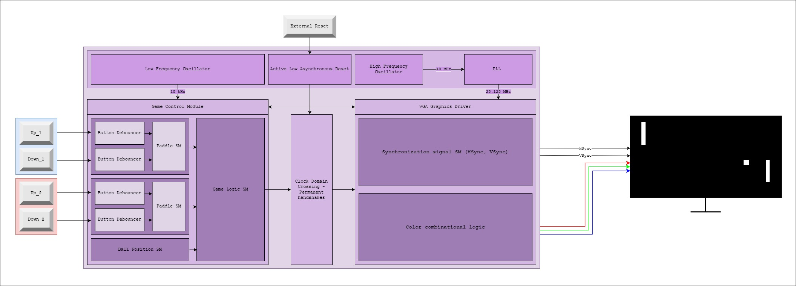

# FPGA Pong

## About the project

This project implements the classic game of Pong that I wrote to learn RTL design and SystemVerilog.

Main features:
    - VGA output controller.
    - Button debouncer.
    - Paddle and ball logic.
    - Collision detection.
    - Multiple clock domains.
    - Safe clock domain crossing logic.

## Logic architecture

The following diagram illustrates the core architecture of the system:

