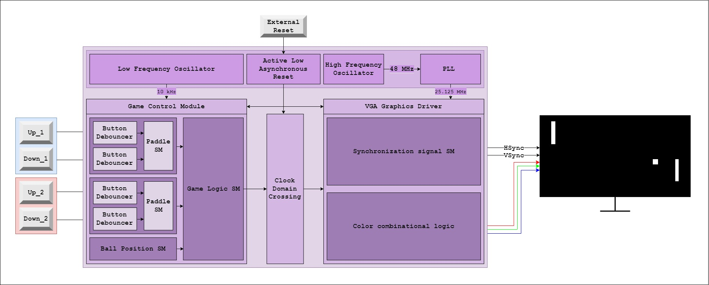

# 🎮 FPGA Pong

This project implements the classic game of Pong that I wrote to learn RTL design and SystemVerilog.

Main features:
* 🖥️ VGA output controller.
* 🕹️ Button debouncer.
* 🏓 Paddle and ball logic.
* 💥 Collision detection.
* ⏰ Multiple clock domains.
* 🌉 Safe clock domain crossing logic.

## Logic architecture

The following diagram illustrates the core architecture of the system:

### Clock generator module

The clock generator module provides two clock outputs required by the game control and display drivers.  
It uses the FPGA’s internal high-frequency oscillator to generate a 48 MHz clock, which is then refined through a Phase-Locked Loop (PLL) to produce the 25.125 MHz clock required to run the VGA display.  
Simultaneously, it uses the internal low-frequency oscillator to generate a 10 kHz clock required to run the game control module.

### Button debouncer module

The button debouncer module filters out mechanical bounce from a noisy button input.  
It uses a parameterized debounce interval (in clock cycles) and a simple state machine that toggles state only after the input has been stable for the specified time. The output (debounced_button) reflects a clean, stable button press signal, eliminating false triggers caused by contact bounce.

### Paddle module

The paddle module manages up/down button inputs to generate position changes.  
It uses two instances of the **button debouncer** to filter noisy button signals, then accumulates the debounced inputs over a configurable interval. After this interval, it outputs a position change signal (-1, 0, or 1) based on the net button presses, providing rate-limited paddle movement.

### Game control module

The game controller module implements the core game logic.  
It manages two paddles and a ball on a 2D playing field, updating their positions based on debounced button inputs and game physics. The paddles move up or down using the **paddle** modules, while the ball moves autonomously, bouncing off the top and bottom edges and reflecting when hitting paddles. The module also handles scoring by resetting the ball position if it passes a paddle. All movements and timing are controlled via configurable parameters to adjust responsiveness and screen dimensions.

### Clock domain crossing module

The clock domain crossing module provides a reliable method to transfer data from one clock domain (**the game controller's 10 kHz clock domain**) to another (**the VGA controller's 25.125 MHz clock domain**) using a handshake mechanism.  
It ensures safe synchronization of signals across asynchronous clock boundaries using a two-flip-flop synchronizer for both REQ and ACK. Data is latched in the source domain and delivered in the destination domain only when a valid transfer handshake has occurred, avoiding metastability and race conditions.

### VGA graphics driver module

The graphics driver module generates the VGA-compatible video signals (hsync, vsync, and RGB color outputs) needed to display game elements on a 640x480 screen.  
It samples the current positions of these elements and uses internal horizontal and vertical counters to track the pixel being drawn. Based on these coordinates, it determines whether the current pixel is part of a paddle or ball and outputs the appropriate RGB color (white) or black background.  
The module follows standard VGA timing conventions and synchronizes the visual updates with the VGA refresh cycle.

## Target Hardware and Setup Requirements

This project was developed on the IceSugar v1.5 FPGA development board. To run the project successfully on this board, a few additional hardware components are required for input and video output functionality.  
You will need: 
* 4 x push buttons for player control, each connected with a 10kΩ pull-down resistor to ensure stable input readings. 
* For VGA output, a PMOD VGA adapter is used.

### IO Pin Assignments

**PMOD 1** is used to connect four physical push buttons, mapped to button_up_1, button_down_1, button_up_2, and button_down_2.  
**PMOD 2** handles VGA output signals, including hsync, vsync, and RGB color lines (red, green, blue).  
**PMOD 4** includes a reset signal (rst) connected to a switch, allowing the game to be restarted.
